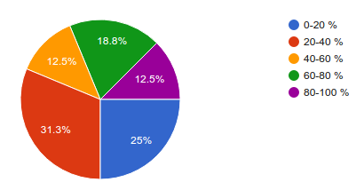

L'enquête a été réalisée au cours du mois de Juin 2016 au centre IRD de Nouméa. Son but est d'établir un premier panorama des besoins existants en gestion de données sur le centre.

## Participation

16 scientifiques ont répondu à l'enquête. Les unités de recherche suivantes ont été représentées :  UMR 065 - LEGOS, UMR 082 - GÉOAZUR, UMR 123 - AMAP, UMR 182 - L'OCEAN, UMR 220 - GRED, UMR 228 - ESPACE-DEV, UMR 235 - MIO, UMR 237 - IMBE, UMR 250 - ENTROPIE, UMR 1342 - LSTM

## État des lieux

**Quel est votre niveau de satisfaction sur la manière dont les données sont actuellement gérées dans votre équipe ?**

 *Légende* 
0 : pas du tout satisfait / 5 : très satisfait

*Remarque* : 75% des personnes interrogées ont un niveau de satisfaction évalué à 2 ou 3

**Pouvez-vous estimer la quantité de ces types de données dans vos données ?**

 

**De quelle(s) manière(s) sont sécurisées aujourd'hui vos données ?**

**Pourriez-vous évaluer la quantité de données qui a déjà été valorisée ?**

 
*Remarque* : 56% des personnes ont 0 à 40% de leur données qui ont déjà été valorisées

**Quel outil de Système d'Information Géographique (SIG) est le plus utilisé dans votre équipe ?**

## Besoins

**Pour quelle(s) étape(s) du cycle de vie d'une donnée auriez-vous le plus besoin d'un accompagnement ?**

**Combien de jeux de données possédez-vous ?**

**Quel volume estimez-vous que ces données représentent ?**

 
*Remarque* : 51% des personnes estiment le volume de leurs données entre 0 et 2 To

**Quel pourcentage de données aimeriez-vous conserver en accès restreint ?**

**Quel pourcentage de données votre équipe aimeriez-vous partager avec le centre ?**

**Quel pourcentage de données aimeriez-vous partager avec le public ?**

**Quels jeux de données aimeriez-vous le plus valoriser ?**

Voici les différentes réponses qui ont été données :  
<blockquote>tableaux données géographique base de données images/vidéos documents textes</blockquote>
<blockquote>base de données accès web</blockquote>
<blockquote>base de données taxonomique</blockquote>
<blockquote>sorties de modéles, réanalyses ou temps réel</blockquote>
<blockquote>base de données</blockquote>
<blockquote>typologie des habitats, physiologie des coraux, suivi du blanchissement corallien, population et comportement des requins en zone Pristines, numérisation de l'herbarium</blockquote>
<blockquote>images/videos métadonnees de textes ou tableaux</blockquote>
<blockquote>données géographiques</blockquote>
<blockquote>séries temporelles bases de données données grillées images/videos</blockquote>
<blockquote>images, données géographiques</blockquote>
<blockquote>les données Seedlink, ainsi que les détections (événements) sont publiques. Les données brutes ne sont pas diffusées</blockquote>
<blockquote>données GIS et photographies</blockquote>
<blockquote>historique MODIS couleur de l'eau NC 250m (15 ans), sortie modèles Océan / atmosphère utilisés valorisées dans les publications, diffusion sous thredds souhaitée</blockquote>
<blockquote>doc Texte, données géographiques, données grillées</blockquote>
<blockquote>données géographiques, images</blockquote>

## Perspectives

**Seriez-vous prêt à faire partie d'un groupe de travail "Gestion de données" ? (ou à laisser quelqu'un représenter votre équipe)**

**Si oui, à quelle fréquence aimeriez-vous avoir ces échanges ?**

