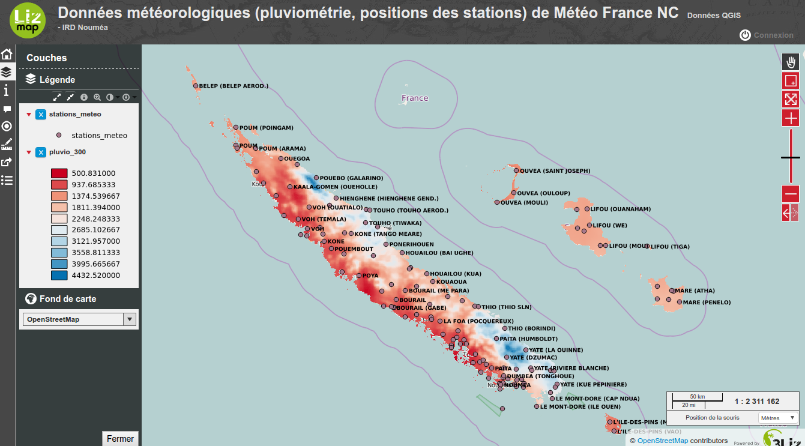

## Accès

Lien d'accès au service : **http://lizmap.data-pacifique.ird.nc**

## Description

LizMap est fourni avec un client web de visualisation qui fait le lien avec les données déposées sur le serveur. Pour le portail de données, cet outil offre une interface conviviale pour visualiser les cartes qui ont été déposées sur le portail de données avec le service [Webdav](../webdav).

L’interface propose, entre autres, des outils de déplacements, un arbre de couches avec légende intégrée, une carte miniature de localisation, la possibilité de changer le fond de carte sur lequel s’affiche les couches (Google, OpenStreetMap, MapQuest, etc.) et une navigation adaptée à l'écran.

