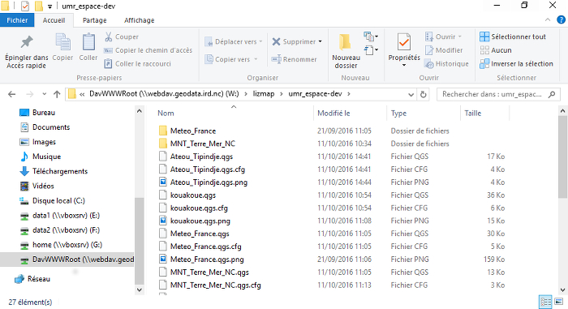

## Accès

Lien d'accès au service : **http://webdav.data-pacifique.ird.nc**

## Description

Ce service permet de déposer sur le portail de données un projet QGIS afin qu'il soit disponible en ligne (les restrictions d'accès sont à définir avec l'administrateur). Le projet peut alors être servi par QGIS Server et visualisé via le service [Lizmap](../lizmap).

Wevdav est un protocole qui permet à la fois de télécharger et de déposer des fichiers. Le téléchargement peut se faire à l'aide d'un simple navigateur web, il suffit alors de cliquer sur les liens qui sont disponibles. Par contre, il est nécessaire d'utiliser un client Webdav pour y déposer des fichiers. Les systèmes d'exploitation Windows, MacOs et Linux proposent un client par défaut.

## Guide d'utilisation

Voici plusieurs tutorial qui montre comment se connecter à un serveur Webdav avec différents systèmes d'exploitation. Il suffit de changer l'adresse du serveur avec celle du portail de données : http://webdav.data-pacifique.ird.nc.

* [Windows 10](http://www.it-connect.fr/connexion-en-webdav-a-owncloud-sous-windows/)
* [Mac OS](https://www.synology.com/fr-fr/knowledgebase/DSM/tutorial/File_Sharing/How_to_access_files_on_Synology_NAS_with_WebDAV#t2_2)
* Linux : [Ubuntu Unity](https://www.synology.com/fr-fr/knowledgebase/DSM/tutorial/File_Sharing/How_to_access_files_on_Synology_NAS_with_WebDAV#t2_3), [Gnome 2](https://www.qnap.com/fr-fr/tutorial/con_show.php?op=showone&cid=76)
